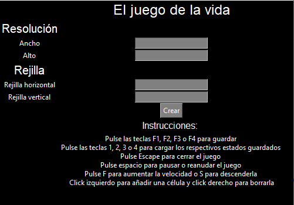

Nombre del proyecto: El juego de la vida V.1.1
Grupo #12
Integrantes
1. Juan Camilo Olaya Arango

Objetivo: Recrear el juego de la vida de John Horton Conway, un sistema autómata

Información básica para ejecutar el programa: 

- El programa requiere de las siguientes librerías: Numpy, Pygame
Ejecutar las siguientes líneas para instalar las librerías:

pip install -r requirements.txt

